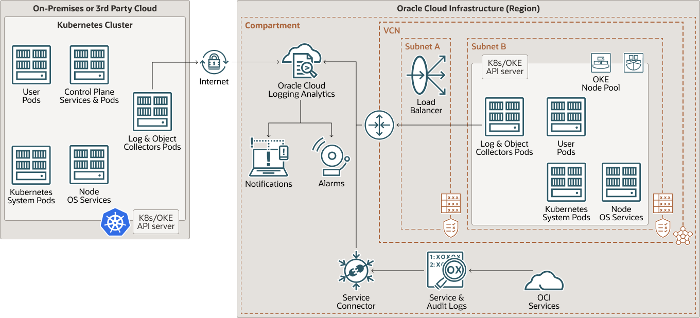

# OCI Kubernetes Monitoring Solution

OCI Kubernetes Monitoring Solution is a turn-key Kubernetes monitoring and management package based on OCI Logging Analytics cloud service, OCI Monitoring, OCI Management Agent and Fluentd.

It enables DevOps, Cloud Admins, Developers, and Sysadmins to

* Continuously monitor health and performance
* Troubleshoot issues and identify their root causes
* Optimize IT environment based on long term data
* Identify configuration, and security issues

across their entire environment - using Logs, Metrics, and Object metadata.

It does extensive enrichment of logs, metrics and object information to enable cross correlation across entities from different tiers in OCI Logging Analytics. A collection of dashboards is provided to get users started quickly.

# Architecture
This architecture shows how you can use Oracle Cloud Infrastructure (OCI) Logging Analytics to monitor a Kubernetes platform and cloud native applications.

Building a monitoring and troubleshooting system for this entire environment is a very challenging task, and may take away valuable time from development and IT teams. A large number of Kubernetes based initiatives fail to take off because of lack of a complementary monitoring solution, which is as robust, customizable, scalable, and is automatically deployable. OCI Logging Analytics bridges this monitoring gap by providing a one-click end-to-end Kubernetes monitoring solution for the underlying infrastructure, Kubernetes platform and cloud native applications.

The following diagram is a sample topology of a Kubernetes Cluster in a single Oracle Cloud Infrastructure region, as discussed in Set up a Kubernetes cluster for deploying containerized applications on Oracle Cloud solution playbook. It shows the infrastructure tier and the second diagram highlights the kubernetes and application tiers.

The architecture has the following components:

* Tenancy
A tenancy is a secure and isolated partition that Oracle sets up within Oracle Cloud when you sign up for Oracle Cloud Infrastructure. You can create, organize, and administer your resources in Oracle Cloud within your tenancy. A tenancy is synonymous with a company or organization. Usually, a company will have a single tenancy and reflect its organizational structure within that tenancy. A single tenancy is usually associated with a single subscription, and a single subscription usually only has one tenancy.

* Region
An Oracle Cloud Infrastructure region is a localized geographic area that contains one or more data centers, called availability domains. Regions are independent of other regions, and vast distances can separate them (across countries or even continents).

* Compartment
Compartments are cross-region logical partitions within an Oracle Cloud Infrastructure tenancy. Use compartments to organize your resources in Oracle Cloud, control access to the resources, and set usage quotas. To control access to the resources in a given compartment, you define policies that specify who can access the resources and what actions they can perform.

* Virtual cloud network (VCN) and subnets
A VCN is a customizable, software-defined network that you set up in an Oracle Cloud Infrastructure region. Like traditional data center networks, VCNs give you complete control over your network environment. A VCN can have multiple non-overlapping CIDR blocks that you can change after you create the VCN. You can segment a VCN into subnets, which can be scoped to a region or to an availability domain. Each subnet consists of a contiguous range of addresses that don't overlap with the other subnets in the VCN. You can change the size of a subnet after creation. A subnet can be public or private.

* Load balancer
The Oracle Cloud Infrastructure Load Balancing service provides automated traffic distribution from a single entry point to multiple servers in the back end.

* Service gateway
The service gateway provides access from a VCN to other services, such as Oracle Cloud Infrastructure Object Storage. The traffic from the VCN to the Oracle service travels over the Oracle network fabric and never traverses the internet.

* Logging Analytics
Logging Analytics is a fully managed SaaS regional service available in more than 27 regions that provides collection, indexing, enrichment, query, visualization, and alerting for logs from any IT component running on on-premises, OCI or 3rd party cloud.

* Logging Analytics Source
A configuration resource Logging Analytics that provides specifications for parsing, extractions, labeling, data masking, and other enrichment to ensure logs are properly ingested and indexed for analysis and monitoring. This architecture uses more than 30 pre-defined sources for Kubernetes services, applications, and objects. These sources are continuously enhanced to provide deeper analytics capabilities.

* Kubernetes System Pods
Kubernetes System Pods are small deployable units of computing that you can create and manage in Kubernetes. A Pod is one or more containers, with shared storage and network resources, and rules for running the containers.

* User Pods
Applications launched on the Kubernetes cluster. All the logs from application pods writing STDOUT/STDERR are typically available under /var/log/containers/. Applications that have custom log handlers may route their logs differently, but in general are available on the node (through a volume).

* Control Plane Services & Pods
Kubernetes platform Control Plane Services and pods. The Control Plane manages the worker nodes and the Pods in the Kubernetes cluster. The worker nodes run the containerized applications. Every cluster has at least one worker node. The worker node(s) host the Pods that are the components of the application workload.

* Node OS Services
Linux services running on the instance on which Kubernetes is installed. Logs are collected on OS services.

Log & Object Collector Pods
Log & Object Collector Pods are made up of replica sets, FluentD, and daemon sets.

* FluentD Collector
FluentD is an open-source data collector that provides a unified logging layer between data sources and backend systems. It allows unified data collection and consumption for a building data processing pipelines. This architecture uses containerized FluentD container that runs as daemon set and replicat set on kubernetes cluster. It uses logging analytics fluentd output plugin to upload logs to Oracle Cloud Logging Analytics.

* Logging Analytics FluentD Plugin
The FluentD output plugin that connects to Oracle Cloud Logging Analytics service in your tenancy to upload or ingest logs collected by FluentD collector.

* Kubernetes Objects
Kubernetes objects are persistent entities in the Kubernetes system. Kubernetes uses these entities to represent the state of your cluster. In this architecture, the following kubernetes object states are collected as logs for historical analysis and troubleshooting:

* Kubernetes Daemon Set
A Kubernetes DaemonSet is a type of workload that runs on Kubernetes and ensures that all (or some) Nodes run a copy of a Pod. As nodes are added to the cluster, Pods are added to them. As nodes are removed from the cluster, those Pods are garbage collected.

* Kubernetes Replica Set
A Kubernetes ReplicaSet is a type of workload that runs on Kubernetes. It maintains a stable set of replica Pods running at any given time. As such, it is often used to guarantee the availability of a specified number of identical Pods

* Container Engine for Kubernetes
Oracle Cloud Infrastructure Container Engine for Kubernetes is a fully managed, scalable, and highly available service that you can use to deploy your containerized applications to the cloud. You specify the compute resources that your applications require, and Container Engine for Kubernetes provisions them on Oracle Cloud Infrastructure in an existing tenancy. Container Engine for Kubernetes uses Kubernetes to automate the deployment, scaling, and management of containerized applications across clusters of hosts.

* Service connectors
Service Connector Hub is a cloud message bus platform. You can use it to move data between services in Oracle Cloud Infrastructure. Data is moved using service connectors. A service connector specifies the source service that contains the data to be moved, the tasks to perform on the data, and the target service to which the data must be delivered when the specified tasks are completed. One service connector is provisioned in this architecture to collect network and load-balancer logs.

* OCI Services
Oracle Cloud Infrastructure (OCI) services are a platform of cloud services that enable you to build and run a wide range of applications in a highly-available, consistently high-performance environment.

* Service and Audit Logs
Service and Audit Logs are captured in OCI Logging service. OCI Logging is a highly scalable and fully managed service that is used to access the VCN and Load Balancer service logs through the Service Connector.