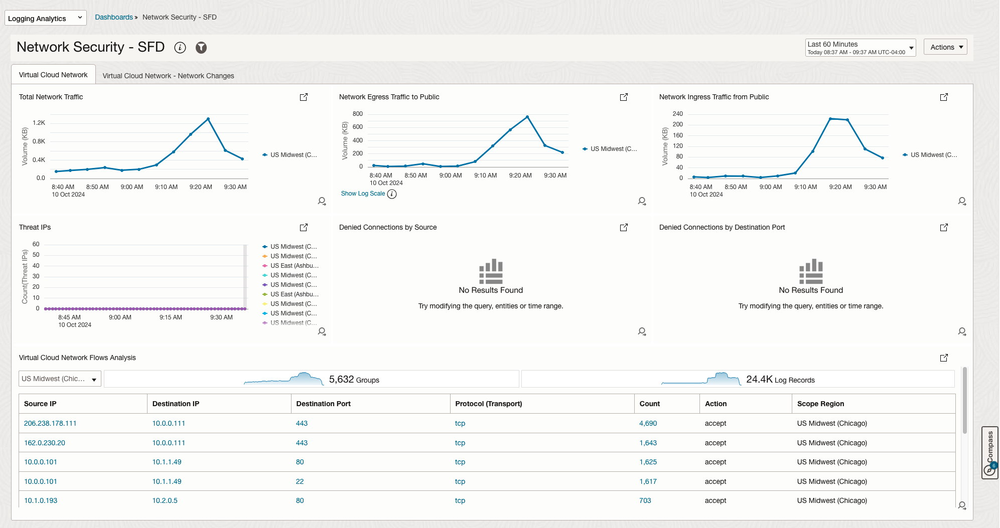
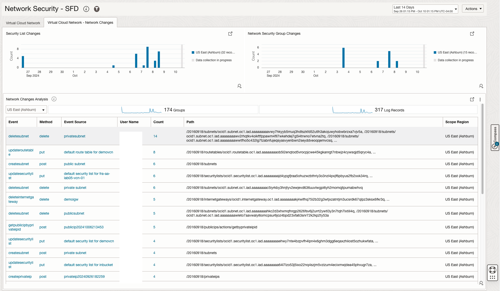
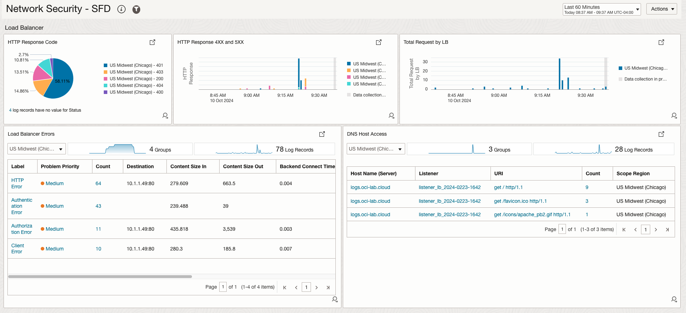
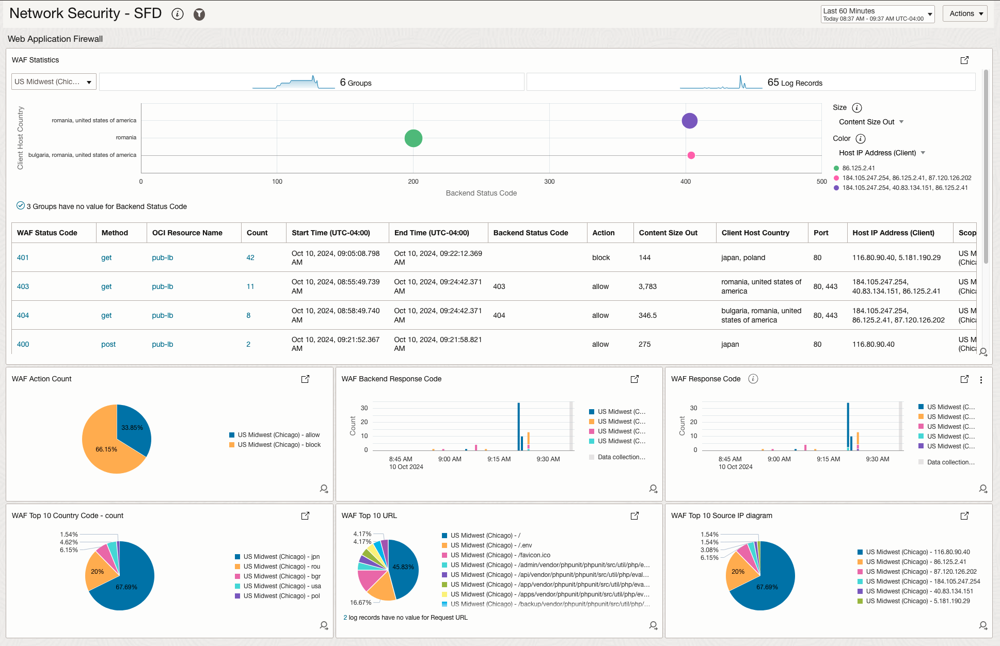
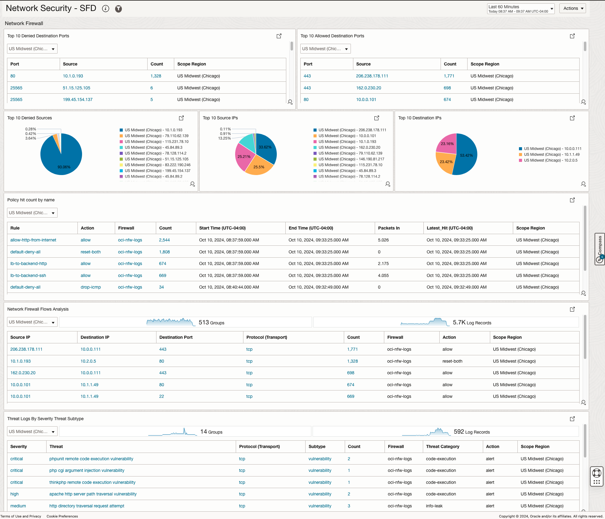
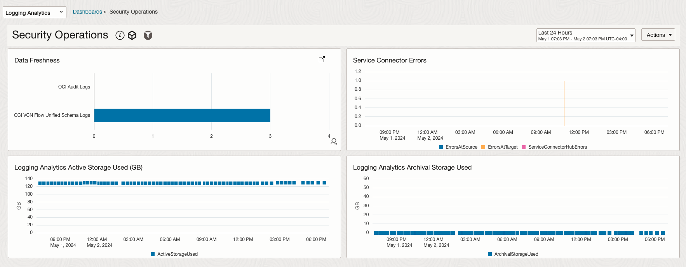
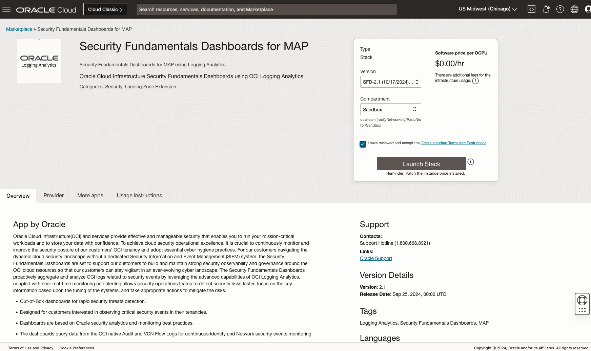
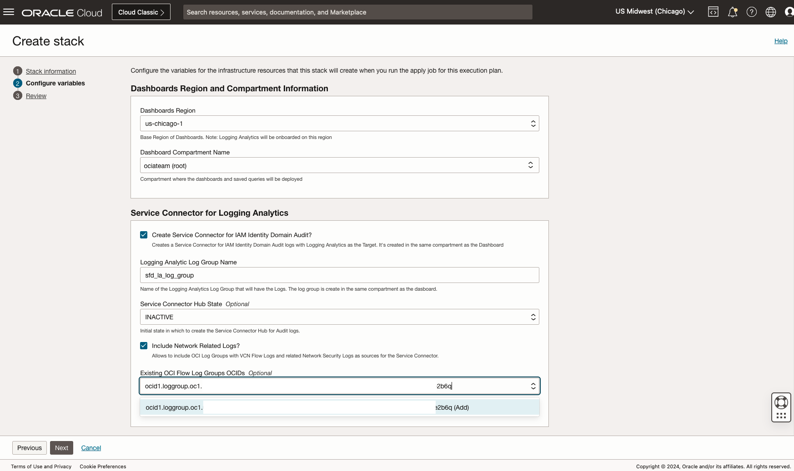

# Security Fundamentals Dashboards

### Dashboards screenshots
* Identity Dashboard

* Network Dashboard

* Security Operations

### Security Fundamentals Dashboards Onboarding
* Logging Analytics should be set up in your tenancy 
  * [Logging Analytics](https://docs.oracle.com/en-us/iaas/logging-analytics/index.html)
* Configure Logging Analytics
  * [Configure Your Service](https://docs.oracle.com/en-us/iaas/logging-analytics/doc/configure-your-service.html)
  * [Prerequisite IAM Policies](https://docs.oracle.com/en-us/iaas/logging-analytics/doc/prerequisite-iam-policies.html)
  * [Enable Access to Logging Analytics and Its Resources](https://docs.oracle.com/en-us/iaas/logging-analytics/doc/enable-access-logging-analytics-and-its-resources.html)

* Enable logs for Network Security
  * [Enable Logs for VCN Flow Logs](https://docs.oracle.com/en-us/iaas/Content/Network/Tasks/vcn-flow-logs-enable.htm#:~:text=Enable%20VCN%20Flow%20Logs%20for,balancers%2C%20or%20network%20load%20balancers.&text=Open%20the%20navigation%20menu%2C%20click,Click%20Enable%20flow%20logs.)
  * [Enable Logs for OCI Network Firewall Traffic Logs and Threat Logs](https://docs.oracle.com/en-us/iaas/Content/network-firewall/enable-logs.htm#:~:text=Enable%20the%20Oracle%20Cloud%20Infrastructure,Click%20Enable%20Service%20Log.)
  * [Enable Logs for OCI Load Balancer Access Logs and Error Logs](https://docs.oracle.com/en-us/iaas/Content/Balance/Tasks/enable_log.htm)
  * [Enable Logs for OCI Web Application Firewall](https://docs.oracle.com/en-us/iaas/Content/Logging/Reference/details_for_lbwaf.htm)

### Security Fundamentals Dashboards Log Ingestion
  * [Ingest OCI VCN Flow Logs into OCI Logging Analytics](https://blogs.oracle.com/observability/post/how-to-ingest-oci-vcn-flow-logs-into-oci-logging-analytics)
  * [Ingest OCI Audit logs into OCI Logging Analytics](https://redthunder.blog/2021/06/01/getting-insights-with-oci-audit-log-with-logging-analytics-via-service-connector/)

  * Enable Threat Intelligence Enrichment for Log Sources
    Logging Analytics is integrated with Oracle Threat Intelligence to automatically receive the threat feed as the logs are ingested. The feature is available for all the log sources in the regions where both Logging Analytics and Oracle Threat Intelligence services are enabled. The Threat IPs widget makes use of this feature, which is not enabled by default. 
    To enable:
    
    1.	In OCI console, Navigate to Observability and Management -> Logging Analytics->Administration
    2.	Click on “Sources”. in search box in the top right, search for “vcn”. You should get 2 sources: “OCI VCN Flow Unified Schema Logs” and “OCI VCN Flow Logs”
    3.	Edit each source. On the Edit screen, click the “Field Enrichment” tab. Ensure the "Enabled" checkbox is checked for the "Geo location" function
    4.	Edit the "Geo location" function by clicking the three dots, and check "Threat Intelligence enrichment" checkbox. 
    5.	If it is not, check the checkbox and click "Save Changes"
    6.	Repeat above 5 steps for OCI Network Firewall Traffic Logs, OCI Network Firewall Threat Logs, OCI Load Balancer Access Logs, OCI Load Balancer Error Logs, OCI WAF Logs, OCI Audit Logs Sources. 

### Security Fundamentals Dashboards Deployment using OCI Marketplace App
Security Fundamentals Dashboards (SFD) OCI Marketplace App offers a seamless, one-click solution for customers to effortlessly deploy SFD dashboards and automate the collection of essential security-related logs in Logging Analytics. This streamlined approach simplifies the setup of comprehensive security monitoring across OCI environments, empowering customers to enhance their cloud security posture with minimal effort.

To launch the Marketplace app:

* In OCI console, Navigate to Marketplace -> All Applications
* Search “Security Fundamentals Dashboards”
* Check I have reviewed and accept the Oracle standard Terms and Restrictions.
* 
* Click Launch Stack
* Review the Stack Information and Click Next
* Select the Dashboard Compartment from the dropdown to deploy the dashboards
* Check Create Service Connector for IAM Identity Domain Audit?
* Update the Logging Analytics Log Group Name if needed
* Switch Service Connector Hub State from INACTIVE to ACTIVE
* Check Include Network Related Logs? checkbox
* Add the Logging service Network related logs Log Group OCIDs 
* Click Next for the final Review, Click Create to run the stack 
* 

It may take some time for the data to start flowing into the dashboard. You will not see any data unless there are activities on the target system(s) that would be picked up by the corresponding widget/query.

### Security Fundamentals Dashboards Visulization
You can now use Security Fundamentals Dashboards to detect security threats and issues in OCI tenany. For example, Threat IPs detected in VCN Flow Logs accessing OCI cloud resources or spikes detected in Network Ingress Traffic from Public IPs need further investigation from the security teams to mitigate security risks across your tenancy. 

    

### Security Fundamentals Dashboard Region Filter
You can now use Security Fundamentals Dashboards Region filter to query log data from other Logging Analytics regions and dynamically adjust the dashboards widgets based on Region you selected. 