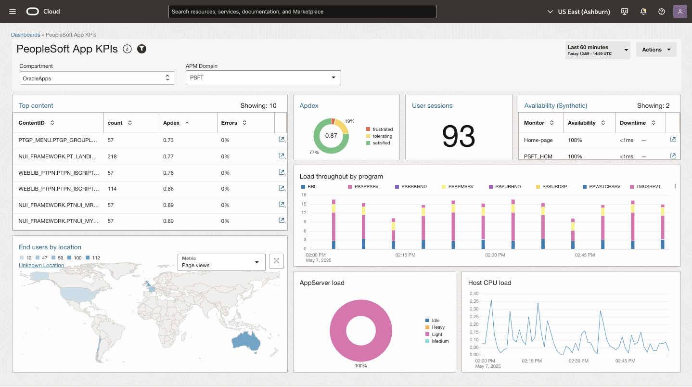
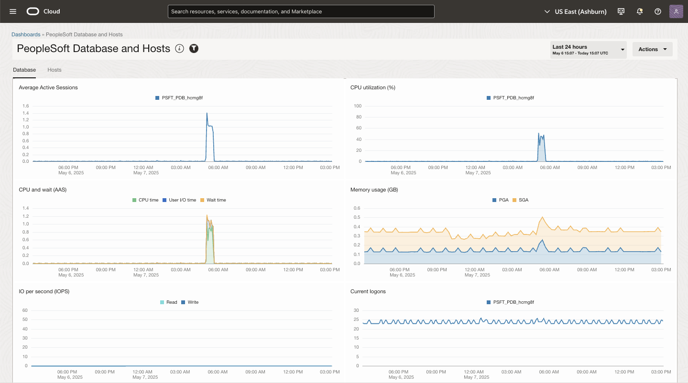
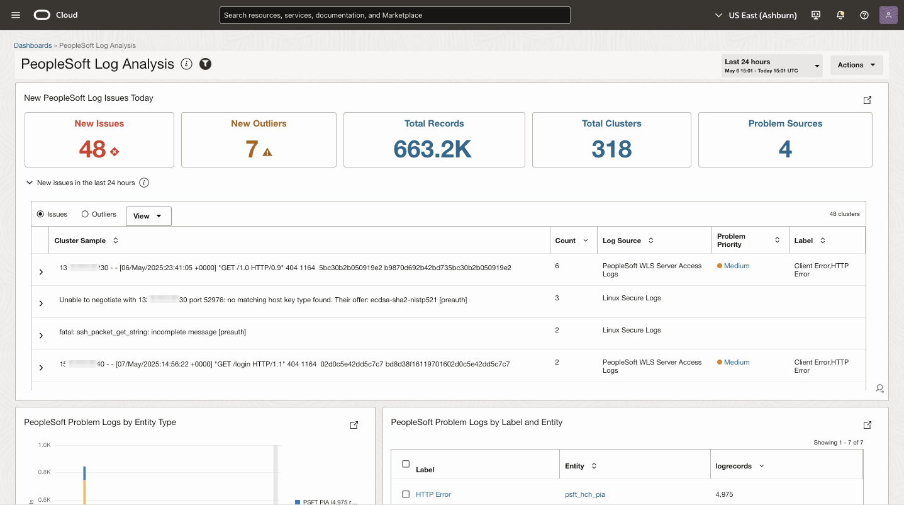

# Oracle PeopleSoft Observability Solution Content

The Observability and Management solution for PeopleSoft gives step by step instructions to fully monitor PeopleSoft on-premises or in the cloud.
This custom content is provided to supplement the solution guide which is available on the [Oracle Help Center](https://docs.oracle.com/en/learn/psobs/).

## Dashboards screenshots

* PeopleSoft App KPIs Dashboard
  

* PeopleSoft Database and Hosts Dashboard
  

* PeopleSoft Log Analysis
  

## Import Dashboard Content

For ease of deployment, some of the Logging Analytics saved searches used in the dashboards rely on having the log files stored in a Log Group called PSFT.  It is recommended to put all logs from the application components, hosts, and database into a single log group to allow for simplified filtering as well as access control.  If your log files are stored in a log group with a different name, update that in the JSON files as needed prior to import.  Look for \'Log Group' = PSFT in the query string element.
When importing the dashboard files, choose the compartment for the dashboard and the saved searches based on your own environment, not the compartment in the selected file.
The [Management Dashboards documentation](https://docs.oracle.com/en-us/iaas/management-dashboard/doc/export-and-import-dashboards.html) describes the steps to import the dashboards.

## Import APM Configuration Content

Before importing the APM configuration content, edit the JSON file to replace all placeholders with relevant values for your environment.  These are identified in the file as \<YOUR DB OCID>, \<YOUR REGION>,  \<YOUR TENANT> and so on.  Remove the surrounding angle brackets.  Other content in angle brackets that does not include text in all caps, should be left as it is and it will be replaced by APM when drilling down to other services.
When importing the APM Config content, select all checkboxes to include all configuration resources, including Apdex thresholds, Span filters, Span enrichment, and Drilldown configurations.
The [APM documentation](https://docs.oracle.com/en-us/iaas/application-performance-monitoring/doc/configure-apm-domain-export-import.html#GUID-C78D32F0-46D2-4E07-B0D3-578C6D008F80) describes the steps to import domain configuration content.
