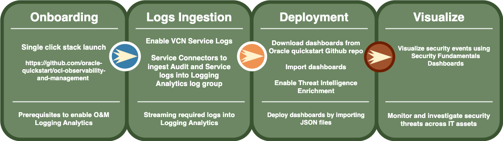

# Security Fundamentals Dashboards for MAP

### Dashboards screenshots
* Identity Dashboard
*NOTE: SFD Identity Dashboard is **ONLY** applicable for **monitoring local user activities**. If you use **Identity Domain** or **IDCS**, please stay tuned for the new Identity Domain Dashboard.*

* Network Dashboard

* Security Operations

### Enable Security Fundamentals Dashboards

### Security Fundamentals Dashboards Onboarding
* Logging Analytics should be set up in your tenancy 
  * [Logging Analytics](https://docs.oracle.com/en-us/iaas/logging-analytics/index.html)
* Configure Logging Analytics
  * [Configure Your Service](https://docs.oracle.com/en-us/iaas/logging-analytics/doc/configure-your-service.html)
  * [Prerequisite IAM Policies](https://docs.oracle.com/en-us/iaas/logging-analytics/doc/prerequisite-iam-policies.html)
  * [Enable Access to Logging Analytics and Its Resources](https://docs.oracle.com/en-us/iaas/logging-analytics/doc/enable-access-logging-analytics-and-its-resources.html)

### Security Fundamentals Dashboards Log Ingestion
  * [Ingest OCI VCN Flow Logs into OCI Logging Analytics](https://blogs.oracle.com/observability/post/how-to-ingest-oci-vcn-flow-logs-into-oci-logging-analytics)
  * [Ingest OCI Audit logs into OCI Logging Analytics](https://redthunder.blog/2021/06/01/getting-insights-with-oci-audit-log-with-logging-analytics-via-service-connector/)

  * Enable Threat Intelligence Integration
    Logging Analytics is integrated with Oracle Threat Intelligence to automatically receive the threat feed as the logs are ingested. The feature is available for all the log sources in the regions where both Logging Analytics and Oracle Threat Intelligence services are enabled. The Threat IPs widget makes use of this feature, which is not enabled by default. 
    To enable:
    
    1.	In OCI console, Navigate to Observability and Management -> Logging Analytics->Administration
    2.	Click on “Sources”. in search box in the top right, search for “vcn”. You should get 2 sources: “OCI VCN Flow Unified Schema Logs” and “OCI VCN Flow Logs”
    3.	Edit each source. On the Edit screen, click the “Field Enrichment” tab. Ensure the "Enabled" checkbox is checked for the "Geo location" function
    4.	Edit the "Geo location" function by clicking the three dots, and check "Threat Intelligence enrichment" checkbox. 
    5.	If it is not, check the checkbox and click "Save Changes"
    6.	Repeat above 5 steps for "OCI Audit Logs" Log Source. 

### Security Fundamentals Dashboards Deployment
Download the files to your local workstation. There are 3 files with “.json” extension corresponding to the 3 security dashboards
1.	Identity Security: Identity Security.json
2.	Network Security: Network Security.json
3.	Security Operations: Security Operations.json

Follow these steps to import the JSON files:
1.	Login to tenancy
2.	Navigate to LA Dashboards Console -> Observability & Management -> Logging Analytics -> Dashboards
3.	Click on “Import Dashboards”
4.	Navigate to folder containing dashboards and select the first dashboard JSON file
5.	Select “Specify a compartment for all dashboards” and choose compartment
6.	Select “Specify a compartment for all saved searches” and choose compartment
7.	Click on “Import”
8.	Repeat steps 3-7 for the second JSON file
9.	Navigate to LA Administration -> VCN Flow Log and Audit Log Source -> Field Enrichment tab -> Enable Threat Intelligence enrichment for Public IP or Source IP

It may take some time for the data to start flowing into the dashboard. You will not see any data unless there are activities on the target system(s) that would be picked up by the corresponding widget/query.

### Security Fundamentals Dashboards Visulization
You can now use Security Fundamentals Dashboards to detect security threats and issues in OCI tenany. For example, Threat IPs detected in VCN Flow Logs accessing OCI cloud resources or spikes detected in Network Ingress Traffic from Public IPs need further investigation from the security teams to mitigate security risks across your tenancy. 

    

