# Grafana on OCI

## Overview

This OCI Resource Manager (RM) Stack deploys a pre-configured Grafana Linux instance on OCI.  It automates the setup of a Linux instance, Grafana installation, security configurations, polices and OCI metric integration.

## Prerequisites

Before deploying this stack, ensure you have:

1. An active OCI account with necessary permissions
2. Access to OCI Console
3. A Compartment for the Grafana instance
4. A public VCN
5. SSH public key for instance access

## Stack Components

This stack deploys and configures the following resources:

- Linux compute instance with Grafana
- Dynamic group and policy
- Security list configurations for Grafana access

## Deployment Instructions

### Step 1: Prepare Required Information

Gather the following information before deployment:

- Compartment Name
- Availability Domain name
- Virtual Cloud Name
- Subnet Name (Public)
- SSH public key
- Desired hostname for the instance
- Dynamic group name
- Policy name

### Step 2: Using and Configuring the Grafana Marketplace image

1. Log in to OCI Console
2. Navigate to Marketplace > All Applications
3. Search for *Grafana*
4. Choose the compartment and version and click Launch Instance
5. Fill in the required variables as prompted:

   - General Configuration:
     - Select your Compartment Name
     - Select your Availability Domain
     - Select your Virtual Cloud Network
     - Select your Public Subnet
    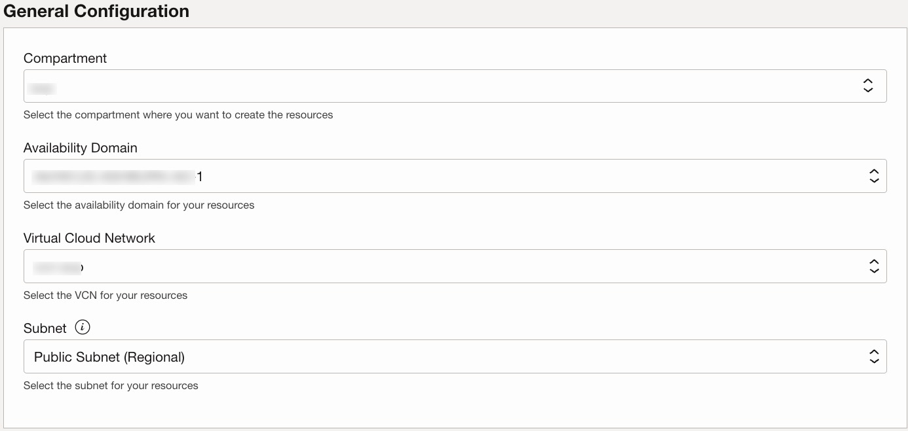

   - Instance Configuration:
     - Create a Hostname of your choice. (Maximum length of 15 alphanumeric characters. Hyphens and underscores are not allowed.)
     - Linux Image (Oracle-Linux-8.9-2024.05.29-0 recommended and tested)
     - Linux Instance Shape (Choose from list, to suite your monitoring requirements). Minimum requirements; memory:512MB, CPU:1.
     - Number of OCPUs (for flexible shapes)
     - Memory in GBs (for flexible shapes)
     - Assign Public IP (default: true)
     - Past in your SSH Public Key
    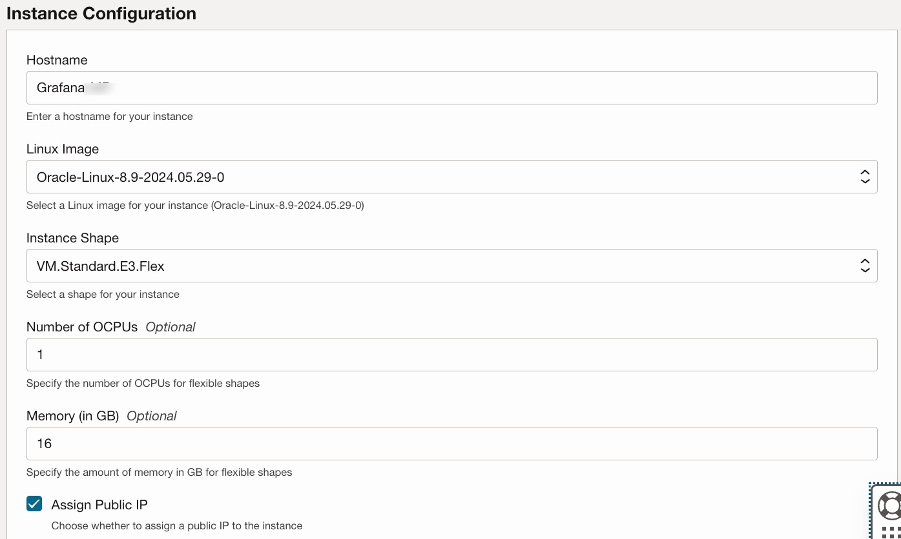

   - Policy Name:
     - Create a Dynamic Group Name
     - Create a Policy Name
    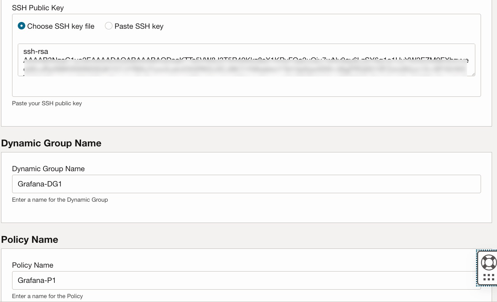

## Post-Deployment Configuration

### Accessing Grafana

1. Locate the public IP address of the deployed instance in the job output
2. Open a web browser and navigate to `http://<instance_public_ip>:3000`

### Changing Default Password

1. Log in with the default credentials:
   - Username: admin
   - Password: admin
2. You will be prompted to change the password on first login
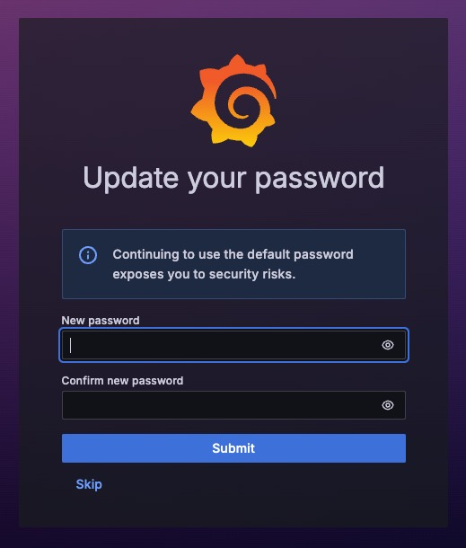

### Configuring OCI Monitoring Data Source to add Instance Principle

Next step is to add the OCI datasource and configure the Instance Principle.

1. Navigate to the Menu on the left > Connections > Data Sources
2. Click on Add data source
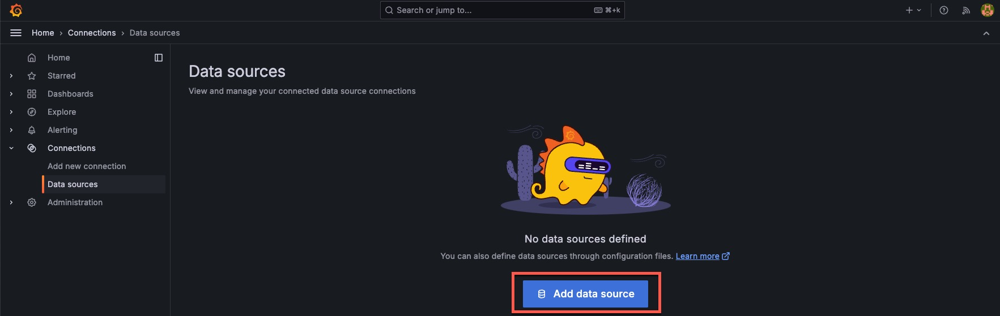
3. In the Search box type : oracle
4. Click on Oracle Cloud Infrastructure Metrics
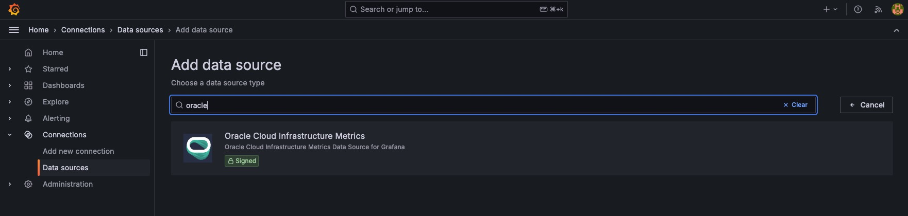
5. Click on Authentication Provider under Connection Details and select OCI Instance
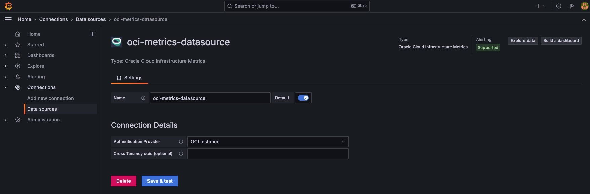
6. Click on Save & test and verify Success
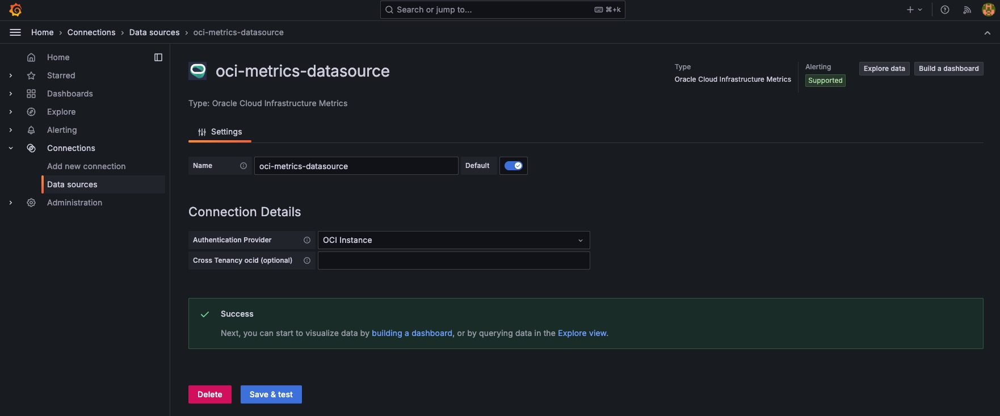

Once the Success box has appeared this confirms the oci-metrics-datasource and Instance Principle have been configured.

Next step is to import the example custom dashboards.

### Adding Custom Dashboards

After deployment, you can import custom dashboards in Grafana to visualise your OCI metrics.
All dashboards are located in the Dashboards directory (<https://github.com/oracle-quickstart/oci-o11y-solutions/tree/main/knowlege-content/grafana-on-oci>)

1. Click on one of dashboard json files (for example Stack_Monitoring.json)
2. Click on "Copy raw content" to copy the json content.
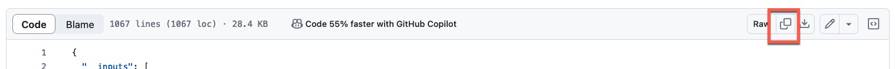
3. On the Grafana install click on Dashboards from the Main Menu and then New > Import
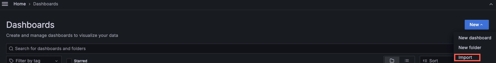
4. Past the copied content (from step 2) to the section under "Import via dashboard JSON model" and click Load
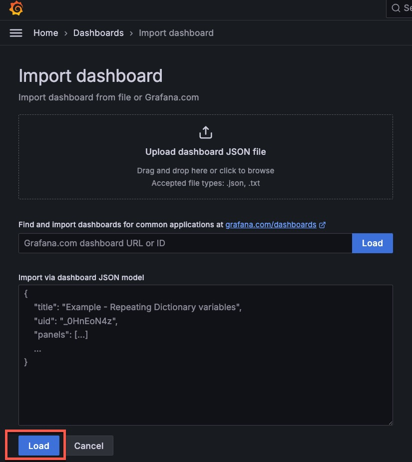
Ensure to choose oci-metrics-datasource as the Default data source.

At this point you have now imported an example Dashboard, follow the instructions in the Dashboard to view your metrics.

## Troubleshooting

1. **Cannot access Grafana**: Verify that port 3000 is open in your VCN's security list and the instance's firewall.
2. **OCI Monitoring Data Source not working**: Check that the dynamic group and policies are correctly configured to allow metric reading.

## Support and Contribution

For support, please open an issue in the project's GitHub repository. Contributions to improve the stack are welcome via pull requests.

## License

[Include license information]
