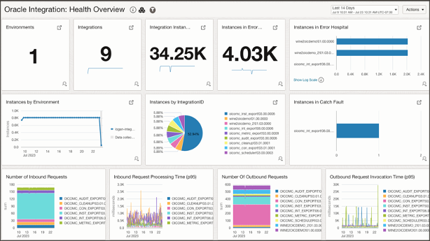
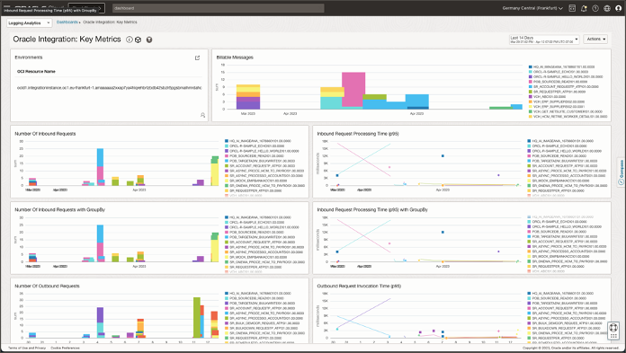
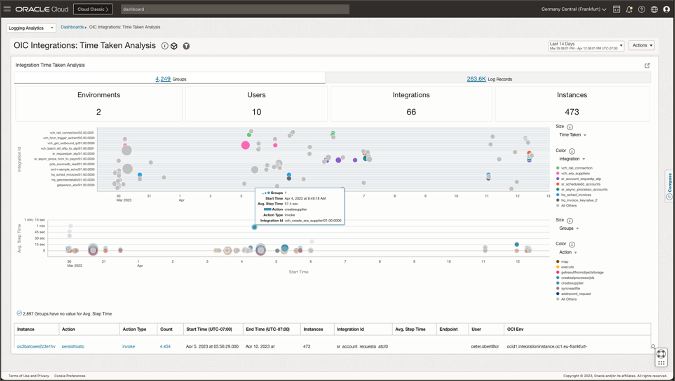
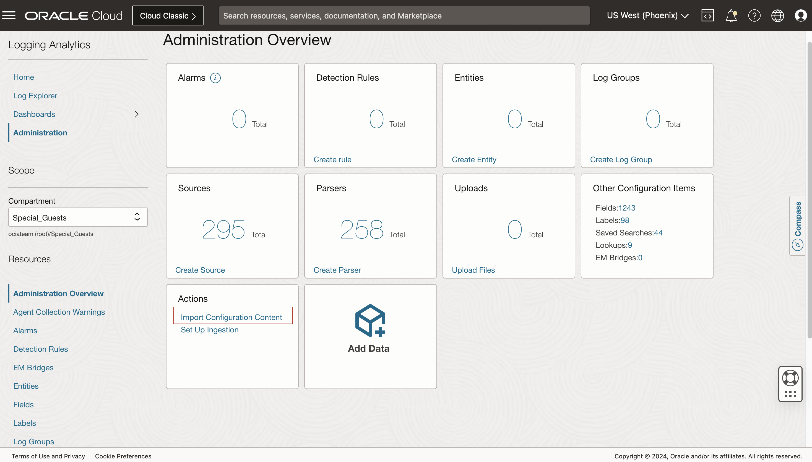
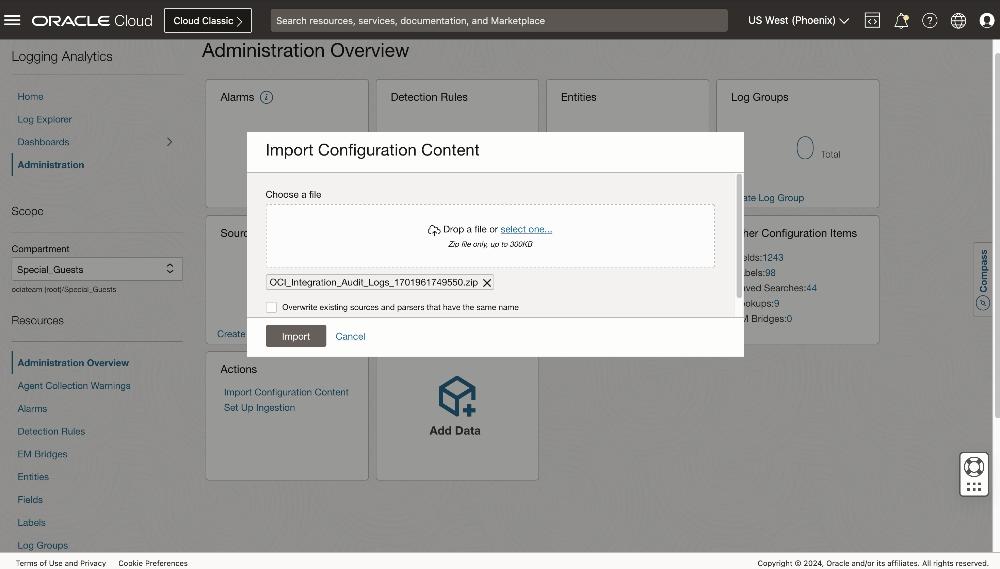
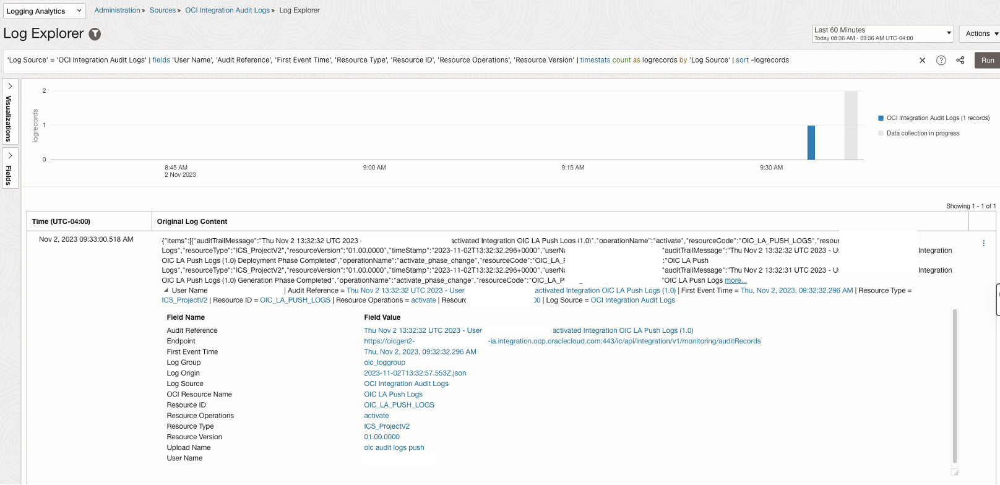
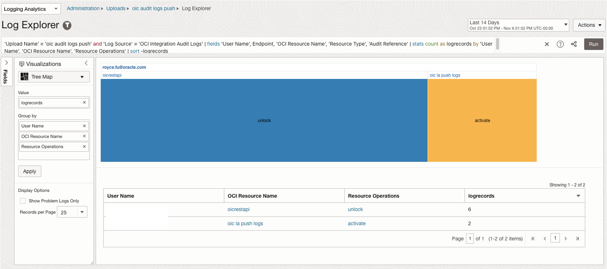

# Oracle Integration Cloud

### Dashboards screenshots

* Oracle Integration Cloud Health Overview

* Oracle Integration Cloud Key Metrics

* Oracle Integration Cloud Performance Analysis

### Import Oracle Integration Cloud Audit Log Source

1.	In OCI console, Navigate to Observability and Management -> Logging Analytics->Administration
2.	Click on "Administration Overview". 
3.  Click on "Import Configuration Content".

    

4.  Select the Oracle Integration Cloud Audit Log Source zip download

    

### Visualize the parsed OIC Audit Records

Oracle Integration Cloud Audit Records Parsed

Oracle Integration Cloud Audit Records Analysis
